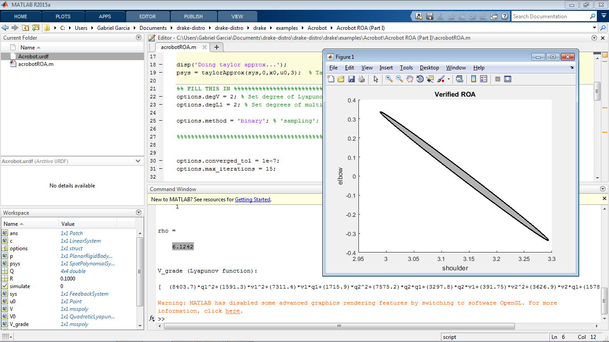
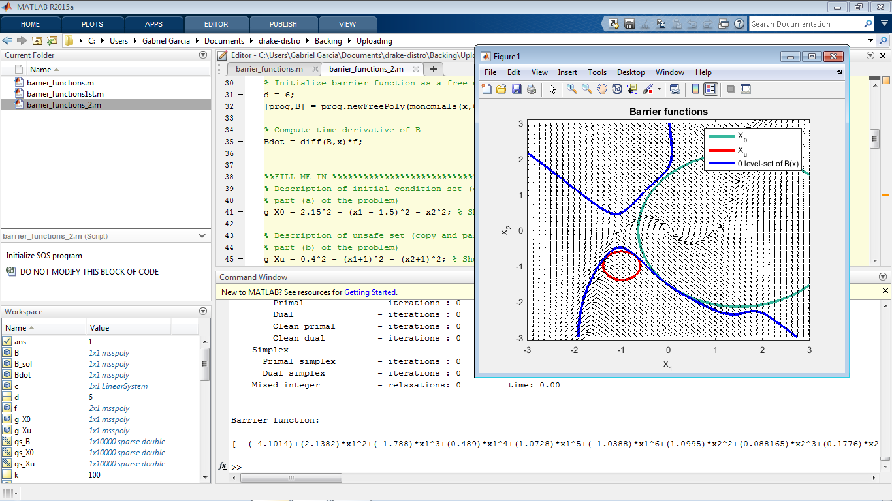
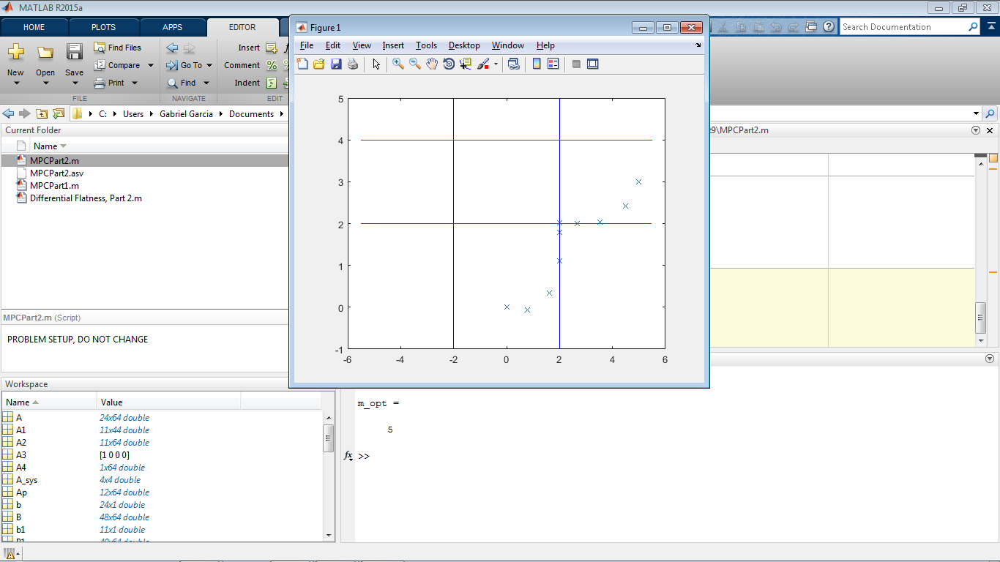
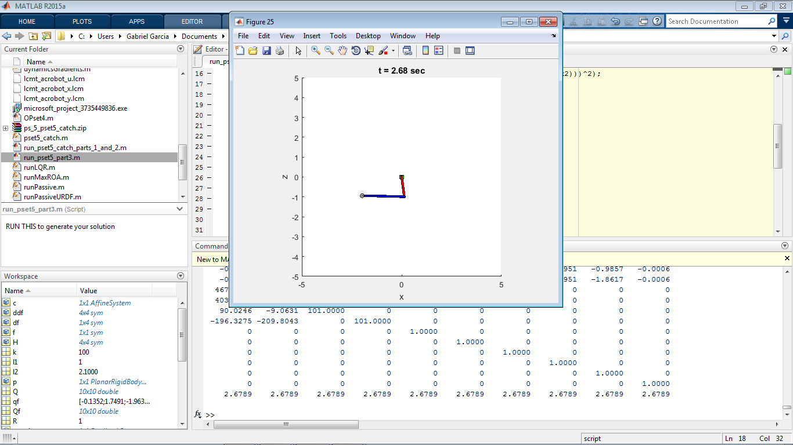

# psets-drake-underactuated-robotics-6.832x

Some homeworks of course Underactuated Robotics 6.832x from edX solved here with code, mainly the ones that involve drake-distro library for MATLAB

So I'm using for this the precompiled versions of drake found at https://github.com/RobotLocomotion/drake/releases. This is because I started solving the problems in 2015 - 2016, preparing myself for the next enrolling, that unfortunately never came. So now, I've dusted off the old files and complete the homeworks I was missing in the same precompiled version of drake. Although the solutions are currently on edX, i've done some modificacions, solving the problems in my way.

Content is as follows:

PSET1: - No drake homework

PSET2: - Value Iteration

PSET3: - Acrobot Feedback Control

PSET4: - Acrobot Region of Attraction
       - Barrier Functions
       
PSET5: - Trajectory Optimization: Direct Collocation
       - TV
       - LQR for robust trajectories
       
       
PSET6: - Poincaré Analysis for Open and Closed Loop control.

PSET7: - ZMP control

PSET8: - Force Closure Restrictions
       - RRT
       - RRT with Dynamic Constraints.
       
       
PSET9: - MPC as QP
       - Differential flatness as QP 

You can find where to put each file in PSETs_6.832x.pdf (some of them require other files, like .urdf or other .m files)

This course deeply inspired me to develop a great conection between me and control and robotics. Some topics I were fascinated was for example, Region of Atraccion (PSET4).

I started playing with the initial condition, and increasing the order of the Lyapunov function and the Lagrange Multipliers, trying always to maximize the size of the ROA. Barrier functions (also PSET4) were also interesting, so I understand there that Lyapunov methods are so important in research of non-linear control.

Another great weapon is Quadratic Program. Although the MPC homework (PSET9) that uses "quadprog" can be sometimes complicated to define because of the restrictions, I particularly used Kronecker product to simplify a lot of the definition of matrices, avoiding excesive use of "for" statement.

Finally, in PSET 5 and 6, I used one of the most important topics for me in the course. The Trajectory Optimization for solving problems in higher dimension systems performing better than other methods, but unluckily losting the global optimality to an local optimality. This is no longer a feedback control, and you need to provide your starting position in order to compute an local optimal trajectory. Because it is open loop, we need to make it robust. For that reason, we use an Time-Variant LQR (TVLQR) that basically performce LQR for each linearization in each point of the trajectory, making finally an closed loop control. 

For me, it will be even more interesting to use this tool to Hybrid Systems, drake has a program for this, and I've done a little application in a 2D Hybrid Quadcopter with TVLQR and TrajOpt. 
